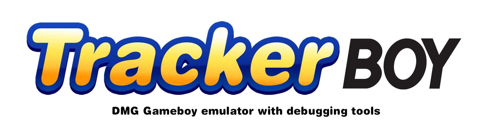

<p align="center">
  
</p>

# TrackerBoy - DMG Gameboy Emulator with Debugging Tools

TrackerBoy is an open-source DMG Gameboy emulator with debugging tools. This emulator is written in C and uses CMake as its build system. It allows you to run Gameboy games and provides debugging functionalities to assist in analyzing and understanding Gameboy games and homebrew.

## About the Project

The Gameboy, released by Nintendo in 1989, is a classic handheld gaming console with a large library of iconic games. TrackerBoy aims to recreate the functionality of the original DMG Gameboy, allowing you to relive the nostalgia of those beloved games on modern hardware.

Additionally, TrackerBoy is equipped with debugging tools, which can be especially useful for developers or enthusiasts interested in reverse-engineering or understanding how Gameboy games work under the hood. The debugging features aim to help identify and analyze various aspects of the game's behavior, memory usage, and CPU instructions.

## How to Build

To build TrackerBoy, follow the steps below:

1. Clone the repository to your local machine using Git:

```bash
git clone https://github.com/RafaelCasamaximo/TrackerBoy.git
```

2. Create a new directory named "build" inside the project folder:

```bash
cd TrackerBoy
mkdir build
cd build
```

3. Run CMake to generate the build files:

```bash
cmake ..
```

4. Build the emulator using the generated build files:

```bash
make
```

The build process should complete successfully, and you will have the TrackerBoy emulator executable ready to run.

## How to Run

After successfully building TrackerBoy, you can run the emulator from the terminal or command prompt. The emulator requires a Gameboy ROM file as a command-line parameter to load the game. Here's how you can run it:

```bash
./TrackerBoy <path_to_gameboy_rom>
```

Replace `<path_to_gameboy_rom>` with the actual file path of the Gameboy ROM you want to play. The emulator should load the game, and you can start playing it right away.

---

Please feel free to customize and expand the README with any additional information, usage examples, or special instructions that may be relevant to your project. Good luck, and happy coding!